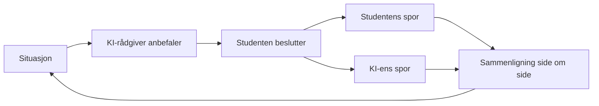

# G115 — Studie v siden av jobb

Gruppeprosjekt i **IBE160 Programmering med KI** ved Høgskolen i Molde, høsten 2026 (15 studiepoeng).

Repoet inneholder gruppens applikasjon og dokumentasjon av utvikling, testing og kvalitetssikring med KI.

## Prosjektet: KI-styrt simulering av prosjektledelse

Vi bygger en webapplikasjon som simulerer planlegging og gjennomføring av et byggeprosjekt. Studenten er prosjektleder og tar de faktiske beslutningene, mens en KI-rådgiver analyserer hver situasjon og anbefaler et tiltak.

Etter hver beslutning kjører simuleringen videre i to spor fra samme tilstand: det som skjedde med studentens valg, og det som ville skjedd om studenten hadde fulgt KI-ens anbefaling. De to utfallene vises side om side. Den sammenligningen er selve læringsmekanikken.

### Hvorfor

Prosjektledelse undervises ofte som statiske verktøy: Gantt-diagram, WBS og risikoregister som skal fylles ut riktig. Studentene lærer hvordan en plan ser ut, men sjelden hvordan den faktisk ryker — hvordan en ressurskonflikt forplanter seg til forsinkelser, eller hvordan en liten risiko vokser til en tapt milepæl. Den typen skjønn bygges ved å ta beslutninger, se konsekvensene og sammenligne med et bedre begrunnet alternativ.

### Slik fungerer det

1. Simuleringen presenterer en situasjon: en fremdriftsstatus, en ressurskonflikt, en endringsmelding eller en risikohendelse.
2. KI-rådgiveren analyserer situasjonen og anbefaler et tiltak, med begrunnelse og forventede konsekvenser.
3. Studenten tar sin egen beslutning, som kan følge eller avvike fra anbefalingen.
4. Simuleringen kjøres frem to ganger fra samme tilstand, og utfallene vises side om side.

Sløyfen gjentas ved hvert beslutningspunkt frem til prosjektet er ferdig.

### Fire typer beslutninger

- Planleggingsstrategi
- Risikohåndtering
- Ressursallokering
- Godkjenning av endringer

### Scenarioer

Scenarioene lages med en hybrid tilnærming. Et mal- og bibliotekslag bygger et sammenhengende skjelett (WBS, ressurser, kostnads- og tidsbasis, milepæler) ut fra prosjektstørrelse, budsjett og risikoprofil. Et språkmodell-lag legger på fortelling og nye risikohendelser, slik at hver gjennomspilling blir forskjellig uten at strukturen bryter sammen.

### Det applikasjonen viser

- Gantt-fremdriftsplan
- Kostnadsprognose
- Risikoeksponering
- Scenarioresultater
- Anbefalte tiltak

### Hva som er nytt

Eksisterende KI-verktøy for prosjektledelse anbefaler tiltak, men viser ikke en beregnet sammenligning av «det du valgte» mot «det KI-en ville gjort». Akademiske byggesimulatorer som Virtual Construction Simulator (VCS3) sammenligner faktisk utfall med en fast plan. Vårt bidrag er å bytte ut den faste planen med en KI-generert og begrunnet anbefaling som sammenligningsgrunnlag — som en debrief i en flysimulator mot en ekspertfasit.

## Omfang for første versjon

**Med:**

- Enspiller-webapp uten brukerkontoer
- Ett domene: byggeprosjekter
- Alle fire beslutningstyper og alle fem visningene
- Hele sløyfen med to simulerte utfall og sammenligning
- En gjennomspilling fra start til ferdig prosjekt

**Ikke med:**

- Flerspiller og forhandling mellom roller
- Støtte for standard planleggingsformater (MSPDI, XER, PMXML)
- Analyse på tvers av flere gjennomspillinger

**Åpne spørsmål:**

- Skal en gjennomspilling kunne lagres og gjenopptas senere?
- Er bygg bekreftet som eneste domene, eller forventes en mer generell simulator?

## Mål for ferdig løsning

- En student kan fullføre en hel gjennomspilling og møte alle fire beslutningstyper minst én gang.
- Ved hvert beslutningspunkt gir KI-rådgiveren en forståelig anbefaling med synlig begrunnelse, og begge utfall beregnes og vises automatisk.
- To gjennomspillinger med samme parametere gir merkbart ulike, men sammenhengende scenarioer.
- Alle visningene oppdateres riktig etter hver beslutning.
- Applikasjonen kan åpnes og spilles gjennom av faglærer uten hjelp.

Kriteriene er gruppens egen tolkning av «ferdig»; det finnes ingen formell vurderingsrubrikk fra faglærer.

## Dokumentasjon og arbeidsmåte

- [Prosjektbrief](brief-G115-AI-prosjektledelse-simulering.md) — fullstendig beskrivelse av problem, løsning og omfang (status: utkast)
- Utviklingen følger [BMAD-rammeverket](https://bmadcode.com/), som ligger i `_bmad/` med tilhørende skills for Claude Code i `.claude/skills/`

## Medlemmer

- Hedda R Endregaard
- Oskar Lia Haaseth
- Elisabeth Sandberg
- Trond Engelstad
