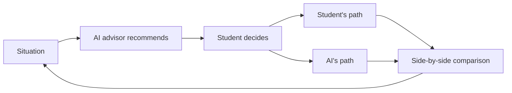

# G115 — Studie v siden av jobb

Group project in **IBE160 Programming with AI** at Molde University College, autumn 2026 (15 ECTS credits).

This repository contains the group's application and the documentation of how it was developed, tested and quality-assured with AI.

## The project: AI-driven project management simulation

We are building a web application that simulates the planning and execution of a construction project. The student is the project manager and makes the real decisions, while an AI advisor analyses each situation and recommends an action.

After every decision the simulation runs forward along two paths from the same state: what happened with the student's choice, and what would have happened had the student followed the AI's recommendation. The two outcomes are shown side by side. That comparison is the teaching mechanic.

### Why

Project management is often taught as static tools: Gantt charts, WBS and risk registers to be filled in correctly. Students learn what a plan looks like, but rarely how it actually breaks — how a resource conflict cascades into schedule slip, or how a minor risk grows into a missed milestone. That kind of judgement is built by making decisions, seeing the consequences and comparing them with a better-reasoned alternative.

### How it works

1. The simulation presents a situation: a schedule state, a resource conflict, a change request or a risk event.
2. The AI advisor analyses the situation and recommends an action, with its reasoning and the consequences it expects.
3. The student makes their own decision, which may follow or diverge from the recommendation.
4. The simulation runs forward twice from the same state, and the outcomes are shown side by side.

The loop repeats at every decision point until the project is complete.

### Four types of decision

- Planning strategy
- Risk response
- Resource allocation
- Change approval

### Scenarios

Scenarios are generated with a hybrid approach. A template and library layer builds a coherent skeleton (WBS, resources, cost and time baseline, milestones) from project size, budget and risk profile. A language model layer adds narrative and novel risk events, so that every playthrough is different without the structure falling apart.

### What the application shows

- Gantt schedule
- Cost forecast
- Risk exposure
- Scenario results
- Recommended actions

### What is new

Existing AI tools for project management recommend actions, but do not show a computed comparison of "what you chose" against "what the AI would have done". Academic construction simulators such as the Virtual Construction Simulator (VCS3) compare the actual outcome with a fixed plan. Our contribution is to replace the fixed plan with an AI-generated, reasoned recommendation as the point of comparison — like a flight simulator debrief against an expert benchmark.

## Scope for the first version

**In:**

- Single-player web app without user accounts
- One domain: construction projects
- All four decision types and all five outputs
- The full loop with two simulated outcomes and a comparison
- One playthrough from start to project completion

**Out:**

- Multiplayer and negotiation between roles
- Support for standard scheduling formats (MSPDI, XER, PMXML)
- Analysis across multiple playthroughs

**Open questions:**

- Should a playthrough be possible to save and resume later?
- Is construction confirmed as the only domain, or is a more general simulator expected?

## Success criteria

- A student can complete a full playthrough and meet all four decision types at least once.
- At every decision point the AI advisor gives a legible recommendation with visible reasoning, and both outcomes are computed and shown automatically.
- Two playthroughs with the same parameters produce recognisably different but coherent scenarios.
- All outputs update correctly after every decision.
- The instructor can open the application and play it through unassisted.

These criteria are the group's own reading of "done"; there is no formal grading rubric from the instructor.

## Documentation and way of working

- [Product brief](brief-G115-AI-prosjektledelse-simulering.md) — full description of the problem, solution and scope (status: draft)
- Development follows the [BMAD framework](https://bmadcode.com/), which lives in `_bmad/` with its skills for Claude Code in `.claude/skills/`

## Members

- Hedda R Endregaard
- Oskar Lia Haaseth
- Elisabeth Sandberg
- Trond Engelstad
